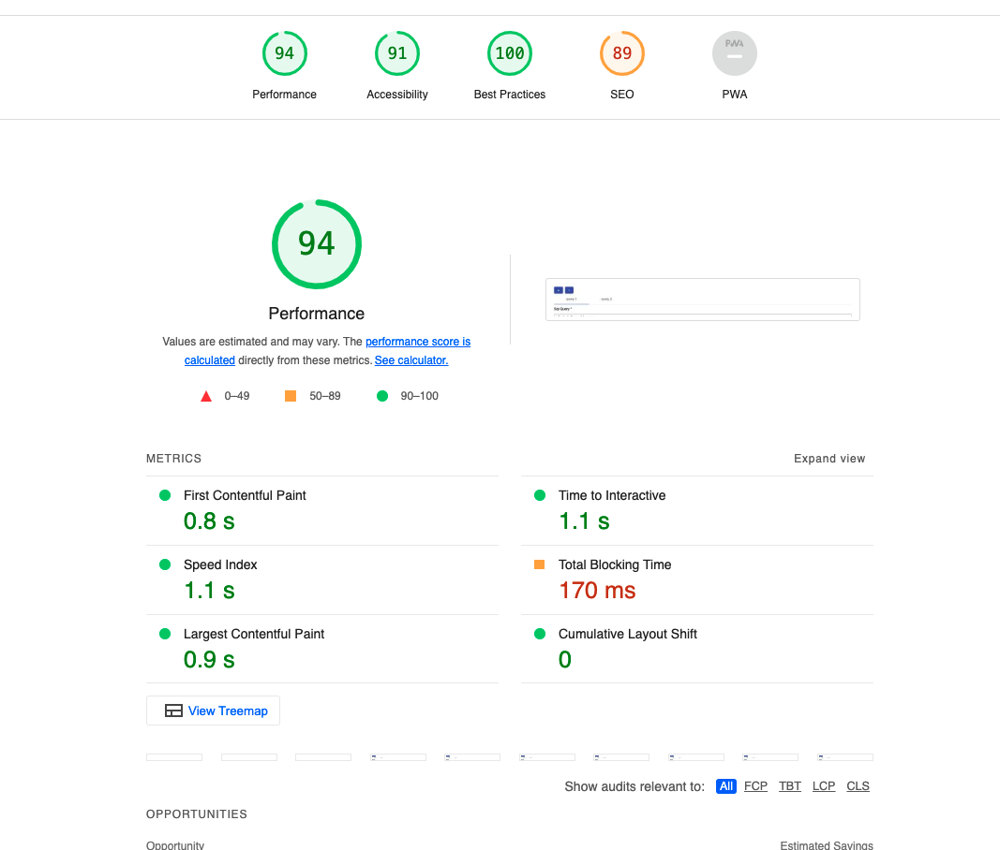

# Atlan Assignment

This app facilitate the user to write the sql query and see their result in a tabular view. The user can open multiple tab to run their different query and these result will persist until user not delete the tab or reset it manually.

## Prerequisite
Before you can build , you must install and configure the
following products on your development machine:

* [Node.js](http://nodejs.org) (v16.13.0) 

## Js Framework
Angular
This project was generated with [Angular CLI](https://github.com/angular/angular-cli) version 14.1.2.

## Build And Run The Application  

### Install Dependency
run `npm instal` in root folder of the app

### Run In Local Development Server

Run `npm run start` for a dev server. Navigate to `http://localhost:4200/`. The application will automatically reload if you change any of the source files.

### Run In Local Production Server

Run `npm run  start:prod` to build the project. The build artifacts will be stored in the `dist/` directory. The application will run  in `http://localhost:7777/`. Just copy this url and paste in browser.

## Page Load Time
To calculate page load time it used the light house tool. user can install that plugin in chrome browser. then run the application in production mode. Once application load in the chrome browser then go to the developer tool and navigate to lighthouse tab. Select the performance option and click the analyze button.

A performance snapshot of this application  is attached. 

## Optimizations To Decrease Page Load Time
* Use webpack bundler , it to tree shaking to remove unused code
* Use es6 module, through this app can consume some part of module as per the requirement.
* compress the build file in brotli format so it reduce the file size and load it faster.
* To run in local i used the light server and used compress technique for faster rendering.
* Note:- There are some more option there can be implement to reduce the load time like `serve worker` and do `PWA` implementation, however due to time crunch these functionality is not implemented.

application demo

https://user-images.githubusercontent.com/8718722/184806384-53a1843b-ad01-45c5-9999-e78cf0c83ce4.mp4

